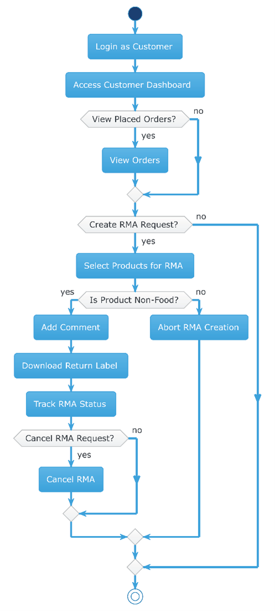
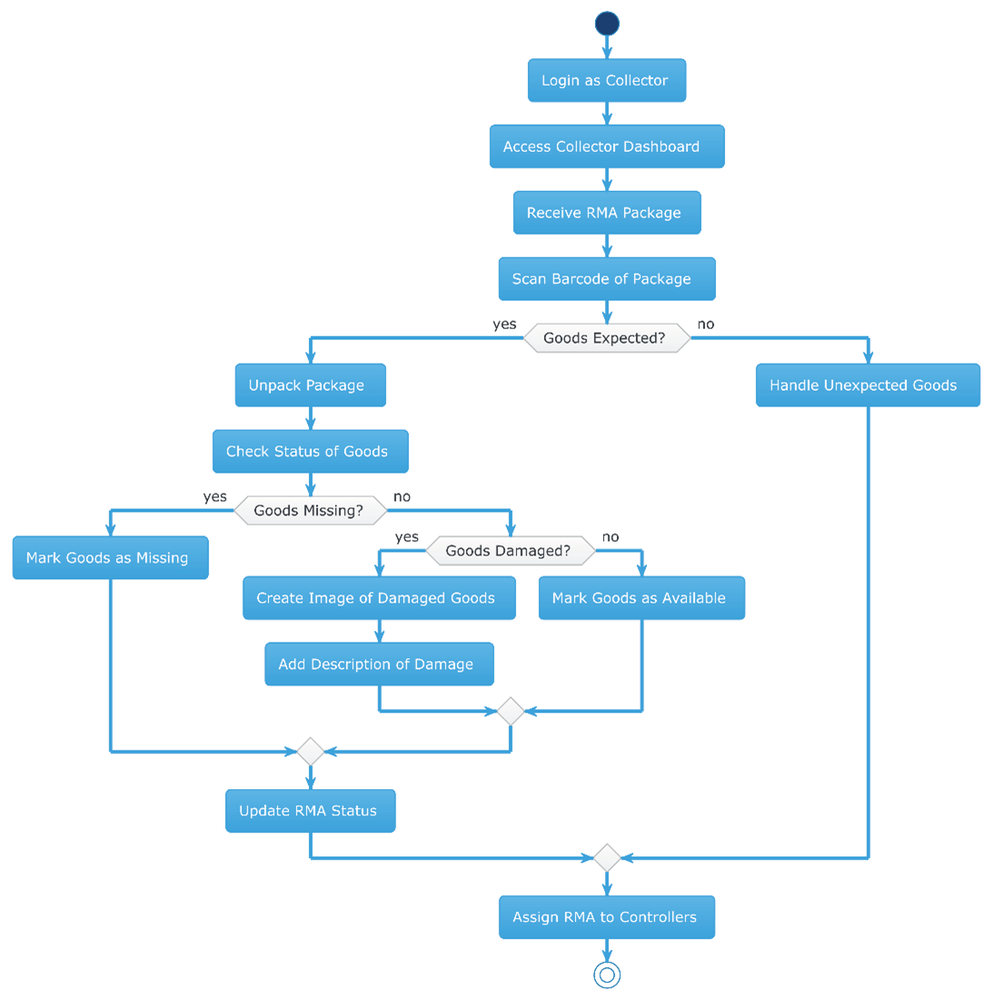
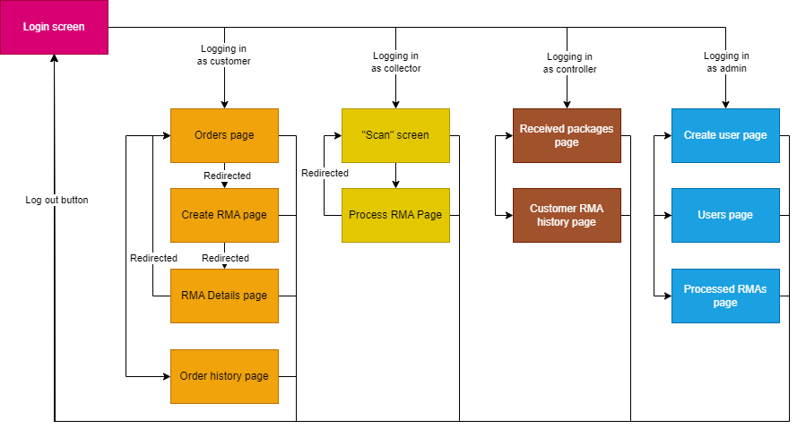
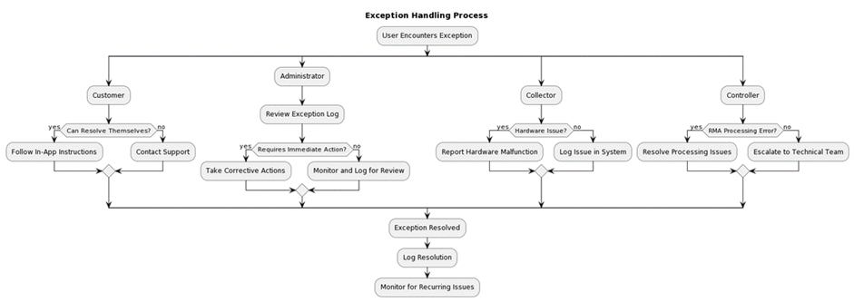

# Functional Design
# Contents
- [Introduction](#a-nametoc1575968280aintroduction)

- [Problem](#a-nametoc752069099aproblem)

- [Context Analysis](#a-nametoc2032942105acontext-analysis)

  * [Market and Industry Context](#market-and-industry-context-)

  * [Technical Environment](#a-nametoc2119129736atechnical-environment-)

  * [User Context](#a-nametoc2020858082auser-context-)

  * [Legal and Regulatory Environment](#a-nametoc1050074421alegal-and-regulatory-environment-)

- [Solution overview](#a-nametoc1634172964asolution-overview)

- [Functional Specs](#functional-specs)

  * [Business logic mapping](#a-nametoc2030039621abusiness-logic-mapping)

  * [Uses cases / User stories](#a-nametoc386219371auses-cases--user-stories)

    + [User stories](#a-nametoc1026642973auser-stories)

    + [Use cases](#a-nametoc928965963ause-cases)

  * [Mockup / Wireframes](#a-nametoc1395390377amockup--wireframes)

    + [General](#a-nametoc469212352ageneral)

    + [Administrator](#administrator)

    + [Customer](#a-nametoc53439903acustomer)

    + [Collector](#a-nametoc555336776acollector)

    + [Controller](#a-nametoc1495447454acontroller)

- [Functional Requirements](#functional-requirements)

- [System configuration](#system-configuration)

- [Non-Functional requirements](#a-nametoc1802461814anon-functional-requirements)

- [Exception handling](#a-nametoc915638972aexception-handling)

  * [1. Exception Scenarios](#a-nametoc1517521775a1-exception-scenarios)

    + [1.1 Administrator Exceptions](#a-nametoc1169198381a11-administrator-exceptions)

    + [1.2 Customer Exceptions](#a-nametoc981070211a12-customer-exceptions)

    + [1.3 Collector Exceptions](#a-nametoc874685992a13-collector-exceptions)

    + [1.4 Controller Exceptions](#a-nametoc1822116247a14-controller-exceptions)

  * [2. Handling Strategies](#a-nametoc1360589300a2-handling-strategies)

    + [2.1 Validation and Verification](#a-nametoc847313178a21-validation-and-verification)

    + [2.2 Error Logging and Monitoring](#a-nametoc868871576a22-error-logging-and-monitoring)

- [Change Log](#a-nametoc127923023achange-log)

# Introduction
This functional design document aims to sketch the software system designed for implementation by myShop, serving as a prototype for a future feature adaptable to clients' existing systems. The primary focus of this project is to streamline and digitalize the Return Merchandise Authorization (RMA) process across diverse businesses.

The scope of the project is to digitalize the RMA process of any business. To better shape the concept of this project, we will identify the problem this system needs to resolve, conduct a context analysis, propose a detailed solution, create user stories and wireframes, decide on functional and non-functional requirements, and define system configurations and exception handling.

This document serves as a comprehensive guide to steer the development and deployment of an innovative RMA system. By systematically addressing each phase, from problem identification to system configuration, this functional design aims to deliver an adaptable and efficient solution that can augment RMA processes across diverse business landscapes.
# Problem
The manual handling of returned items and refunds has proven to be prone to various challenges. This manual process often results in inefficiencies, leading to errors, dissatisfied clients, and the potential loss of valuable customer relationships. Problems such as misplacing packages, overlooking crucial emails, and inaccurately refunding amounts contribute to the complexity and unreliability of the manual approach. These issues not only impact the efficiency of our operations but also diminish our ability to meet customer expectations consistently.

To address these challenges, we recognize the critical need to transition from manual workflows to a digital environment dedicated to the streamlined handling of Return Merchandise Authorizations (RMAs). By implementing a digital solution tailored for managing RMAs, we aim to mitigate errors, improve operational efficiency, and enhance customer satisfaction throughout the returns and refund processes.
# Context Analysis
In this section of the design, we will explore the application's operating environment in detail. It's crucial to grasp the context where the application will function to shape its design and features effectively. This involves considering various aspects such as current market trends, the existing technical infrastructure, what users expect and need, as well as any legal stipulations. Understanding these elements helps us ensure that the application not only meets its intended goals but also aligns well with its surrounding ecosystem.

## Market and Industry Context 
The e-commerce landscape, characterized by evolving trends and consumer expectations, forms the backdrop of our application. The current trends in online retail, particularly in customer service and return policies, are crucial in shaping our approach. Understanding consumer expectations in terms of ease, speed, and communication in the return process is vital. Additionally, a competitive analysis is necessary to benchmark our application against existing market solutions, helping to identify unique value propositions and areas for improvement. 
## Technical Environment 
Integration with myShops existing technical infrastructure is a fundamental consideration. The application needs to seamlessly integrate with current systems, necessitating a detailed understanding of compatibility with existing databases and CRM systems. Concurrently, emerging technologies in e-commerce and data analytics present opportunities for innovation, warranting exploration to potentially enhance the application's capabilities. 
## User Context 
A deep understanding of the application’s users is essential. This includes identifying the primary user groups, their demographic characteristics, and their familiarity with technology. Assessing user needs and the pain points in the current return process will guide us in enhancing the user experience. By mapping the existing return process from the user’s perspective, we can identify areas that require improvement. The objective is to design an RMA application that simplifies and streamlines the return process, leading to a satisfying user experience. 
## Legal and Regulatory Environment 
Adherence to legal and regulatory requirements is non-negotiable. This encompasses compliance with data protection laws, like GDPR, which have significant implications for the application’s design, especially in handling and securing user data. Moreover, understanding e-commerce-specific regulations is crucial to ensure that the application aligns with industry standards and legal mandates. 
# Solution overview
The Return Merchandise Authorization (RMA) application is designed to support the return process for customers who have made a purchase in the web shop of the myShop company. The primary objective is to empower users to initiate returns for products that are within the return policy for those products. The application streamlines the return process allowing customers to send the designated products to a specified mailing address. Once there upon meeting all the return standards the customers are eligible to receive a refund for the returned goods. By making this application the customers will have a better and more efficient user experience returning goods. 

# Functional Specs
## Business logic mapping
The myShop RMA application provides a streamlined approach for managing product returns within a web shop, with distinct workflows tailored to each user role—administrators, collectors, controllers, and customers. Here's an integrated narrative that describes the activity flow for each role:

**Administrator**

The administrator's workflow begins with logging into the system, which grants access to the admin dashboard. From here, the administrator has the option to create or maintain user accounts. If a new user needs to be created or an existing user's information requires updating, the administrator will carry out these actions and subsequently assign the appropriate roles to each user. Additionally, there is a provision for the administrator to create test customer accounts to ensure the system is functioning correctly. After the necessary user accounts and roles are set up, the administrator can view the details of RMA processing, including which collector and controller have handled a particular RMA.

**Customer**

A customer starts their interaction with the application by logging in, which provides access to their dashboard. They can view their placed orders and decide whether to create an RMA request. If the customer chooses to proceed, they will select the non-food products for which they want to initiate a return. They have the option to add comments to their RMA and download the return label for shipping. Once the RMA is created, customers can track the status of their return or cancel the RMA request provided the goods have not yet been received by the company.

**Collector**

The collector's role is pivotal in the physical handling of returned items. After logging in and accessing their dashboard, they receive RMA packages to process. They are responsible for scanning the package barcode to confirm the expected goods and then unpacking and checking the status of these goods. The collector has to determine if the goods are missing or damaged, in which case they can create an image of the damaged goods and add a description of the damage. Following this, the collector updates the RMA status, which then moves the RMA to the controller for further action.

**Controller**

The controller's activities begin with logging in and selecting an RMA to process from the dashboard. They are tasked with deciding the outcome of the RMA, which could involve refunding the customer or notifying them if the product is damaged. If the product is not damaged, the controller has the authority to place it back into stock. Finally, the controller updates the RMA status and can view the RMA history for validation purposes.

Each role within the myShop RMA application has a clear and distinct set of activities that contribute to a seamless RMA process. The administrators manage user roles, collectors handle the physical goods, controllers manage the RMA resolution, and customers initiate and track their return requests. This organized workflow ensures that each stakeholder contributes efficiently to the process, enhancing the overall customer experience and operational efficiency of the webshop.
# System configuration
This chapter outlines the system configuration for the MyShop RMA application, focusing on a single-page application (SPA) architecture. This approach is chosen to ensure a seamless and dynamic user experience. The technology stack and tools have been carefully selected to optimize performance, scalability, and maintainability.
## Development Environment
**Necessary Tools**: The development environment will include Node.js for the runtime environment and npm as the package manager for managing dependencies and scripts.

**Version Control**: Git and GitLab will be used for version control, ensuring efficient collaboration and code management across the development team.
## Frontend Configuration
**Svelte**

Purpose: Svelte will serve as the frontend framework. Its ability to write highly reactive code with minimal boilerplate makes it ideal for a fast and efficient user interface.

Implementation: Svelte will handle rendering the SPA, state management, and user interaction. It will also enable the creation of reusable components for the application's interface.

**Tailwind CSS**

Purpose: Tailwind CSS will be used for styling the application, thanks to its utility-first approach that facilitates rapid UI development and consistent design.

Implementation: Tailwind will be integrated with Svelte for styling individual components, with custom themes and designs developed to align with MyShop's brand guidelines.

**Libraries and Tools**

Webpack: Employed for state management and to bundle the application's assets, improving loading times and application efficiency.
## Backend Configuration
**Node.js and Express**

Purpose: The combination of Node.js and Express will form the backbone of the backend. This duo provides a robust platform for building scalable web applications.

Implementation: Node.js will manage server-side logic, including handling API requests and responses. Express will add a lightweight layer to structure the web application using an MVC architecture.

**API Configuration**

RESTful APIs: The backend will be designed to provide RESTful APIs for communication between the frontend and server.

## Environment Configuration

## Uses cases / User stories
### User stories
1. **Create Accounts:**
- As an admin, I want to create new accounts for collectors and controllers, so that I can efficiently manage access to the RMA application.
2. **Update Account Details:**
- As an admin, I want to update the account details of collectors, collectors, and customers, so that I can keep user information up to date and accurate.
3. **Generate Test Accounts:**
- As an admin, I want to generate test customer accounts, so that I can simulate different scenarios for testing purposes.
4. **Change User Roles:**
- As an admin, I want to change specific roles of users (controller, collector, admin, and customer), so that the right users have the correct permissions and responsibilities based on their role.
5. **View RMA Details:**
- As an admin, I want to view details of each RMA and see which controller and collector handled that RMA, so that all handling can be tracked ensuring better accountability.
6. **Customize Return Policy:**
- As an admin, I want to change the maximum return date for an item, so that I can customize the return policy based on product specifications.
- As an admin, I want to change if an item is able to be returned or not, so that I can adapt our return policy to accommodate different product categories.
- As an admin, I want to change how an item should be returned in terms of packaging, so that I can enforce certain packaging specifications for fragile or sensitive items.
7. **View Order History:**
- As a customer, I want to view the orders that I have placed, so that I can track and view my purchase history.
8. **Create RMA:**
- As a customer, I want to create an RMA for a specific product or a group of products, so that I can start a return process for bought items.
- As a customer, I want to add comments to an RMA, so that I can provide additional information about the returned items.
- As a customer, I want to download a return label, so that I can easily return the goods.
- As a customer, I want to be informed when attempting to create an RMA for goods not allowed to be returned, so that I am aware of the return rules.
- As a customer, I want to be informed when attempting to create an RMA for goods outside of the return period for that good, so that I am aware of the policy.
9. **Cancel RMA Request:**
- As a customer, I want to cancel an RMA request before the goods are received by the company, so that I can have some control over the return process.
10. **QR code Scanning:**
- As a collector, I want to input the QR code of a package to view the expected goods for return, so that I can efficiently process the returned goods.

11. **Update RMA Status:**
- As a collector, I want to update the status of the RMA, so that it can be assigned to controllers for further processing.
12. **Mark Goods Status:**
- As a collector, I want to mark goods as missing, available, or damaged, so that I can update the status of returned goods.
- As a collector, I want to be able to add an image of damaged goods and add a description of the damage, so that I can document the condition of damaged goods.
13. **RMA Overview:**
- As a controller, I want an overview of all RMAs with the status “collected”, so that I can efficiently manage the processing of returned items.
- As a controller, I want to select an RMA for processing, so that I can continue processing the return request.
14. **View RMA History:**
- As a controller, I want to view the RMA history of a customer so that I can make better decisions based on the state of the item in the return process.
15. **Place Product Back in Stock:**
- As a controller, I want to place a product back in stock if it is undamaged, so that the product can be resold.
16. **Refund or Notify Customer:**
- As a controller, I want to be able to refund the customer if the product is undamaged, which updates the status, so that I can resolve the request appropriately.
- As a controller, I want to be able to notify the customer in case of product damage, which updates the status, so that I can resolve the request appropriately.
17. **User Authentication:**
- As a user of the system, I want to be able to log in using a personalized username and password so that I can have access to my own user dashboard.

### Use cases

| **Name: Admin** **create account**                                                                                                                                          |
|:----------------------------------------------------------------------------------------------------------------------------------------------------------------------------|
| **Description: The admin creates new accounts for collectors and controllers in the application**                                                                           |
| **Actor(s): Admin**                                                                                                                                                         |
| **Trigger: Admin initiates account creation**                                                                                                                               |
| 
**Flow:**

- **Admin provides necessary information for a new account**

- **System validates the given information**

- **New accounts get created**
 |

| **Name: Update account details**                                                                                                                                                                                                                 |
|:-------------------------------------------------------------------------------------------------------------------------------------------------------------------------------------------------------------------------------------------------|
| **Description: The admin updates account details for collectors, controllers and customers**                                                                                                                                                     |
| **Actor(s): Admin**                                                                                                                                                                                                                              |
| **Trigger: Admin initiates account updating**                                                                                                                                                                                                    |
| 
**Flow:**

- **Admin select an account to update** 

- **Admin modifiers account details to whatever it needed to change to**

- **System validates these new changes**

- **System updates the account information**
 |

|**Name: Generate test customers**|
| :- |
|**Description: The admin creates test customers for testing purposes** |
|**Actor(s): Admin**|
|**Trigger: Admin initiates test account generation**|
|
**Flow:**

- **Admin specifies the number of test customer accounts**

- **System generates test customer accounts with random data**
|

|**Name: Change user roles**|
| :- |
|**Description: The admin changes roles of users (controller, collector, customer and admin)**|
|**Actor(s): Admin**|
|**Trigger: Admin selects a user and changes their role**|
|
**Flow:**

- **Admin selects the user whose tole needs to be changed**

- **Admin modifies the user’s role from role list** 

- **System updates the user’s tole**
|

|**Name: view RMA details**|
| :- |
|**Description: The admin views details of each RMA, including information about the handling controller and collectors**|
|**Actor(s): Admin**|
|**Trigger: Admin selects an RMA to view details**|
|
**Flow:**

- **Admin selects an RMA**

- **The system displays detailed information about the selected RMA.** 
|

|**Name: change maximum return date**|
| :- |
|**Description: The admin changes the maximum return date for an item, customizing the return policy**|
|**Actor(s): Admin**|
|**Trigger: Admin selects modify return policy for a specific item.**|
|
**Flow:**

- **Admin selects the item**

- **Admin adjusts the maximum return date**

- **The system updates the return policy for the specified item**
|

|**Name: change returnable status**|
| :- |
|**Description: The admin changes whether an item is returnable or not, changing the return policy** |
|**Actor(s): Admin**|
|**Trigger: Admin modifies the returnable status of a specific item**|
|
**Flow:**

- **Admin selects the item**

- **Admin toggles the returnable status**

- **The system updates the return policy**
|

|**Name: change packaging requirements**|
| :- |
|**Description: The admin changes how an item should be returned in terms of packaging**|
|**Actor(s): Admin**|
|**Trigger: admin modifies packaging requirements for a specific item**|
|
**Flow:**

- **Admin selects the item**

- **Admin adjusts the packaging requirements**

- **The system updates the return policy for the item.**
|

|**Name: view orders**|
| :- |
|**Description: The customer views a list of order they have placed**|
|**Actor(s): Customer**|
|**Trigger: Customer selects the “View Orders” tab**|
|
**Flow:**

- **Customer navigates to the view orders section** 

- **The system displays a list of their previously made orders**
|

|**Name: create RMA**|
| :- |
|**Description: The customer creates a Return Merchandise Authorization (RMA) for either a specific product or a group of products**|
|**Actor(s): Customer**|
|**Trigger: Customer initiates the creation of an RMA**|
|
**Flow:**

- **Customer selects product(s) for return** 

- **Customer provides necessary details for the return** 

- **The system generates an RMA.**
|

|**Name: add RMA comments**|
| :- |
|**Description: The customer adds comments to a created RMA to provide additional information** |
|**Actor(s): Customer**|
|**Trigger: Customer selects an RMA and chooses to add comments.**|
|
**Flow:**

- **Customer selects an existing RMA**

- **Customer adds comments to the RMA**

- **The system updates the RMA with added comments**
|

|**Name: download return label**|
| :- |
|**Description: The customer downloads a return label to properly return the goods**|
|**Actor(s): Customer**|
|**Trigger: Customer selects an RMA and chooses to download the return label**|
|
**Flow:**

- **Customer selects an RMA**

- **Customer chooses to download the return label**

- **The system generates and provides the return label for donwload**
|

|**Name: receive notifications**|
| :- |
|**Description: The customer receives notifications when attempting to create an RMA for goods not allowed to be returned**|
|**Actor(s): Customer**|
|**Trigger: Customer attempts to create an RMA**|
|
**Flow:**

- **Customer initiates the RMA creation process**

- **The system checks for return eligibility** 

- **System notifies the customer if the gods are not allowed to be returned and the reason why**
|

|**Name: cancel RMA**|
| :- |
|**Description: The customer cancels an RMA request before the goods are received by the company**|
|**Actor(s): Customer**|
|**Trigger: Customer selects an RMA and chooses to cancel the request**|
|
**Flow:**

- **Customer selects an existing RMA**

- **Customer chooses to cancel the selected RMA**

- **The system updates the status of the cancelled RMA**
|

|**Name: scanning barcode**|
| :- |
|**Description: The collector scans the barcode of a package to view the expected goods in the package**|
|**Actor(s): Collector**|
|**Trigger: Collector initiates the scanning process**|
|
**Flow:**

- **Collector uses a barcode scanner on the package**

- **The system displays the expected items to be inside the package**
|

| **Name: update RMA status**                                                                                                                                                                    |
|:-----------------------------------------------------------------------------------------------------------------------------------------------------------------------------------------------|
| **Description: The collector updates the status of an RMA so that it can be assigned to controlllers for further processing**                                                                  |
| **Actor(s): Collector**                                                                                                                                                                        |
| **Trigger: collector selects an RMA and chooses to update its status**                                                                                                                         |
| 
**Flow:**

- **Collector selects an existing RMA**

- **Collector updates the status of the RMA**

- **The system updates the RMA status and assigns it to controllers**
 |

|**Name: mark goods**|
| :- |
|**Description: The collector marks goods as missing, available or damaged** |
|**Actor(s): Collector**|
|**Trigger: Collector selects an RMA and chooses to mark goods**|
|
**Flow:** 

- **Collector selects an existing RMA**

- **Collector marks goods based on the state of the examined goods**

- **The system updates the state of these goods based on the inputted status**
|

|**Name: adding image and description**|
| :- |
|**Description: The collector adds an image of damaged goods and provides a description of the damage to document the condition**|
|**Actor(s): Collector**|
|**Trigger: Collectors selects an RMA and chooses to add an image and description**|
|
**Flow:**

- **Collector selects an existing RMA from the RMAs he has access to**

- **Collector captures an image of the damaged goods**

- **Collector adds a description of the damage and captured picture to the RMA**

- **The system updates the RMA with the image and description**
|

|**Name: View RMA overview**|
| :- |
|**Description: The controller views an overview of an overview of all RMAs with the status “collected” for efficient management**|
|**Actor(s): Controller**|
|**Trigger: Controller selects the "View RMA Overview" option**|
|
**Flow:**

- **Controller navigates to the RMA management section**

- **The system displays an overview of collected RMAs**
|

|**Name: select RMA**|
| :- |
|**Description: The controller selects and RMA for processing to continue the return request**|
|**Actor(s): Controller**|
|**Trigger: Controller selects and RMA from the overview**|
|
**Flow:**

- **Controller selects an RMA from the list**

- **The system provides detailed information about the selected RMA**
|

|**Name: view RMA history**|
| :- |
|**Description: The controller views the RMA history of a customer to assist in the decision making of refunds**|
|**Actor(s): Controller**|
|**Trigger: Controller start reviewing a return**|
|
**Flow:**

- **Controller selects a returned item**

- **Controller clicks customer connected to the returned item**

- **System shows previous returns made by selected customer**
|

|**Name: place returned item into stock**|
| :- |
|**Description: The controller places an undamaged item back in stock for resale.**|
|**Actor(s): Controller**|
|**Trigger: Controller selects an RMA with an undamaged product**|
|
**Flow:**

- **Controller selects undamaged product in chosen RMA**

- **Controller clicks to place the selected item back into stock**

- **The system adds the choses item back into stock for resale**
|
##

|**Name: refund customer**|
| :- |
|**Description: The controller refunds the customer if the product is undamaged, updating the status**|
|**Actor(s): Controller**|
|**Trigger: Controller selects and RMA with an undamaged product**|
|
**Flow:** 

- **Controller selects an undamaged product in chosen RMA**

- **Controller initiates the refund process**

- **The system updates the RMA status as finished**

- **The system processes the refund**
|

|**Name: notify customer**|
| :- |
|**Description: The controller notifies the customer in case of product damage, updating the status for appropriate resolution**|
|**Actor(s): Controller**|
|**Trigger: Controller selects an RMA with damaged goods**|
|
**Flow:**

- **Controller selects the damaged product(s) in an RMA**

- **Controller marks them as damaged**

- **The system sends an automated message to the customer notifying them it will not be refunded**

- **The system updates the RMA status as finished**
|

|**Name: logging in** |
| :- |
|**Description: The user logs into the system using a personalized username and password to access their dashboard**|
|**Actor(s): Customer, controller, collector and admin**|
|**Trigger: User goes to the login page**|
|
**Flow:** 

- **User provides a valid username and password**

- **The system validates the inputted credentials**

- **Upon successful validation the user gets access to their personalized dashboard**
|

## Mockup / Wireframes
Below are described basic layouts and functionalities of pages available to different users. The only wireframe, that is included in both mobile and desktop formats is the collector’s interface, as its practically necessary for him to have the portable solution. Full fetched designs for both desktop and mobile resolutions are to come later.
### General

This is the basic login screen. Functions exactly as expected, after entering a valid password and username a user gets access to one of interfaces. Depending on the account type they are logging in as, the available functionality changes. After logging in the user is forwarded to the page the account is representing - customer, collector, controller or admin. Every interface has multiple buttons on the top that can be used to get to the related page.
### Administrator

The “Create user” page of admin interface is the "Home" page of an admin. Presents an admin an opportunity to create different user accounts. Here with a “role” dropdown one of 3 roles can be created – controller, collector, or customer (for testing purposes). If customer is selected, then the only field shown is the number of accounts to create. Then using test environment data, specified amount of customers will be created.

Next page available in admin interface is “users” which displays all the created admin, collector, controller, and collector accounts created. Therea are search based on name implemented, using the field in the top left corner, as well as filtering via the role of an account on the right. Near every shown account a pencil icon is shown, clicking on which opens a popup with a popup with a simple form filled with current data of a user, then with this form user data can be changed.

Last screen available to the admin is “Processed RMAs”. Here every recent RMA is being shown, together with its unique ID, current status and the staff members who handled the RMA. Searching and filtering are also possible the same way it is done with users on previous screen.
### Customer

After logging in the customer can see “My refunds” as their home page. Here they can see the order number of their RMA, and its status. Its also possible to view the items that were send with that RMA, upon clicking on the RMA itself. Its possible to search by order number or items inside of it. If the status is “package sent” than it is possible to cancel the RMA by pressing the “X” near the item. If the package is already received by the warehouse or is handled by the controller the option to cancel disappears.

The other screen available is the “New Refund” screen. Here the customer can select from the range of recently bought goods, add comments on why they are returning those goods, and submit a request. After that they are forwarder to the next page, with their RMA information.

This is the next page after the user creates an RMA. Here the user can check their order id, the items they added to an RMA, and a QR code, which is a representation of order id. The “Download label” button will create a .pdf file for the customer to print and put on the package they plan to return the goods in. This new RMA is added to their list of refunds with status “package send”, as after completing this step, they should be sending the package with goods in to the company warehouse.

Now, in case there are issues when creating an RMA, such as an item being bought more than 14 days ago, being a food item or maybe meets some other constraints the company specified, after pressing “submit” they are shown a pop-up detailing what went wrong when creating their RMA.
### Collector

After logging in the collector, they are shown a welcome message, and a “scan” button. The scan button opens their devices camera, and upon detecting a QR code, it will forward the collector to the corresponding RMA handling page. On that page they can see the details of the order, such as its id and the goods that are supposed to be inside the package. Then they can open the package, check the package for missing or broken items and create a status update on that RMA. The report consists of the status, like “broken”, “missing” or “ok”, comments and an image, so that the collector can show the damage found. Below are the same two screens, for desktop.

### Controller

“Received” page of the controller’s interface consists of a list of all the RMAs that have been handled by the collector. From the list on the left they can select an RMA to look through, see all the information that the collector provided and determine the verdict – approve or reject. 

The other page available to the controller is the “customers” page, where they can see all the customers that have requested a refund in the past and view their history of refunds. Upon clicking on an item in the history, a detailed description of that refund can be seen, with items, comments, and pictures if available (looks similar to the previous screen described, only with “approved” or “rejected” verdicts).

This is the navigation map of the application. Every interface is accessible from the login screen, the same way the login screen is accessible from any interface via the "log out" button.
Every line with arrows on both sides means that one page is accessible from another and vice versa

# Functional Requirements
To better understand the functional requirements, we will lay out the business and user requirements first.

Business requirements focus on the high-level objectives and goals of the organization that the myShop RMA application aims to achieve. These requirements describe the underlying needs that the app is designed to fulfill, aligning with the organization's strategies and market position.

|**ID**|**Requirement**|**MoSCoW**|**Source**|
| :- | :- | :- | :- |
|B1|The system should enhance customer satisfaction by streamlining the return process.|M|John Zanoni - letter |
|B2|The system should reduce the processing time of returns and refunds.|M|John Zanoni - letter |
|B3|The system should provide detailed reporting features for tracking and managing returns.|M|John Zanoni - letter |
|B4|The system should aid in inventory management by accurately updating stock levels.|M|John Zanoni - letter |
|B5|The system should comply with company policy for product returns and with GDPR regulations for customer data handling.|M|John Zanoni - letter|

Understanding and meeting the needs of end-users is paramount in the development of any successful system or application. User requirements outline the specific functionalities, features, and experiences expected by the individuals who will interact directly with the system.

For this system, there will be 4 roles: admin, client, collector and controller.

|**ID**|**Requirement**|**MoSCoW**|**Source**|
| :- | :- | :- | :- |
|U1|As an admin, I want to create and manage the accounts.|M|John Zanoni - letter|
|U2|As an admin, I want to be able to change the roles of accounts.|M|John Zanoni - letter|
|U3|As an admin, I want to be able to see the details of each RMA.|M|John Zanoni - letter|
|U4|As an admin, I want to be able to change RMA restraints on items.|M|John Zanoni - interview|
|U5|As a client, I want to be able to view the orders that I have placed.|M|John Zanoni - letter|
|U6|As a client, I want to be able to create a return request.|M|John Zanoni - letter|
|U7|As a client, I need to be able to cancel an RMA.|M|
John Zanoni - letter

|
|U8|As a collector, I want to be able to scan the QR codes on the packages I receive.|M|John Zanoni - letter|
|U9|As a collector, I want to be able to change the status of an RMA.|M|
John Zanoni - letter

|
|U10|As a collector, I want to be able to add more detail about a package to an RMA.|M|
John Zanoni - letter

|
|U11|As a controller, I want to be able to see all the collected RMAs.|M|
John Zanoni - letter

|
|U12|As a controller, I want to be able to see a client’s RMA history.|M|
John Zanoni - letter

|
|U13|As a controller, I want to be able to put a returned item back into stock.|M|
John Zanoni - letter

|
|U14|As a controller, I want to be able to update the status of an RMA after handling.|M|
John Zanoni - letter

|
|U15|As a user of the system, I want to be able to log in using username and password.|M|
John Zanoni - letter

|

Functional requirements constitute the fundamental building blocks that define the specific capabilities, features, and behaviors expected from a system or application. These requirements outline the explicit functionalities and tasks that the system must perform to meet the needs of its users and stakeholders.

Based on the client’s letter and the interview conducted, we propose these functional requirements:

|**ID**| **Requirement**                                                                                                                                   |**MoSCoW**|**Source**|
| :- |:--------------------------------------------------------------------------------------------------------------------------------------------------| :- | :- |
|F1| Users need to be logged in the system to be able to access their respective actions.                                                              |M|John Zanoni - letter|
|F2| The admin must be able to assign roles to users.                                                                                                  |M|John Zanoni - letter|
|F3| The admin must be able to see which employee(s) handled every RMA.                                                                                |M|
John Zanoni - letter

|
|F4| If a customer wants to return items from an order, the system must let the client choose which items to return.                                   |M|John Zanoni - interview|
|F5| The system must send a message to the client once the controller has refunded them.                                                               |M|John Zanoni - interview|
|F6| The system must have restraints on which items can be returned.                                                                                   |M|John Zanoni - letter|
|F7| The system must show the client information and warnings about how they should handle the returned items.                                         |M|John Zanoni - interview|
|F8| The system must keep track of the status of the items to be returned and show the status to the client.                                           |M|
John Zanoni - letter

|
|F9| The system must cancel the RMA if the client requests it.                                                                                         |M|
John Zanoni - letter

|
|F10| The system must not let a customer cancel a RMA if the retuned package has been scanned by the collector.                                         |M|
John Zanoni - letter

|
|F11| The system must show the collector a list of expected items once they scan the QR code on a package.                                              |M|
John Zanoni - letter

|
|F12| The system must require the collector to add a picture and a description to items marked as damaged.                                              |M|
John Zanoni - letter

|
|F13| The system must let the collector to change the RMA status of the package to collected after they fill in all the required information.           |M|
John Zanoni - letter

|
|F14| The system must send the collected RMAs to the controllers.                                                                                       |M|
John Zanoni - letter

|
|F15| The system must show the collected RMAs to the controller.                                                                                        |M|
John Zanoni - letter

|
|F16| The system must show the details of a RMA to the controller once it has been clicked on.                                                          |M|
John Zanoni - letter

|
|F17| The system must let the controller start the process of refunding a customer.                                                                     |M|
John Zanoni - letter

|
|F18| The system must notify a customer when the controller decided to refund them.                                                                     |M|John Zanoni - interview|
|F19| The system must notify a customer when the controller has decided to not refund them because their item was damaged.                              |M|
John Zanoni - letter

|
|F20| The system must increase the stock number of an item if the controller choses to put a retuned item back into stock.                              |M|
John Zanoni - letter

|
|F21| The system must show the controller the RMA history of the clients that requested a RMA.                                                          |M|
John Zanoni - letter

|
|F22| The system must mark a RMA as processed once the controller has either refunded the client or informed them of their decision to not refund them. |M|Advice|
|F23| The system must let the collector insert the QR code manually.                                                                                    |M|Advice|

# Non-Functional requirements

In addition to the explicit functionalities and features, a comprehensive understanding of a system's performance, security, scalability, usability, reliability, and other intrinsic qualities is essential to ensure its success. Non-functional requirements encompass these critical aspects, shaping the overall performance and user experience.

|**ID**|**Requirement**|**MoSCoW**|**Source**|
| :- | :- | :- | :- |
|NF1|The web application must work on mobiles.|M|John Zanoni - letter|
|NF2|The system must implement access control using a username and password, to ensure that only authorized users can access the system.|M|
John Zanoni - letter

|
|NF3|The system response time should be less than 200ms.|S|Advice|
|NF4|The recovery point objective (RPO) should not be more than 1 hour.|S|Advice |
|NF5|The recovery time objective (RTO) should not be more than 2 hours.|S|Advice|
|NF6|The system should support 30 users logged in at the same time.|S|Advice|
|NF7|User authentication and authorization mechanisms should comply with industry standards (OAuth, OpenID Connect (OIDC), and SAML (Security Assertion Markup Language).|S|Advice|
|NF8|The system must show error messages that should be clear and provide guidance to users in case of incorrect inputs or system issues.|S|Advice|
|NF9|The system’s code should follow standardized conventions to facilitate easy maintenance and updates.|S|Advice|
|NF10|The system should be compatible with major web browsers and mobile devices to cater to the varied needs of users in different roles.|S|Advice|
|NF11|The system contains an inbox to which messages like the package being received or the refund fulfilled are sent.|M|Advice|

# Exception handling
Handling exceptions is a key part of keeping the RMA system at myShop running smoothly. In this chapter, we approach how to deal with unexpected issues that come up during the return process. We know that things don't always go as planned, so we have put together a set of guidelines to help manage these situations. This way, whether an administrator, customer, collector, or controller, will have a clear idea of what to do when things don't go as expected.
## 1. Exception Scenarios
### 1.1 Administrator Exceptions
- Scenario: Difficulty in creating or updating user accounts.
- Handling: Implement validation checks and provide clear error messages. Enable a fallback option for manual intervention by a system supervisor.
### 1.2 Customer Exceptions
- Scenario: Issues in creating RMA requests, especially for items not eligible for return or outside the return period.
- Handling: Ensure clear, informative messages are provided to the customer. Implement real-time checks to prevent submission of ineligible RMAs.
### 1.3 Collector Exceptions
- Scenario: Barcodes not scanning correctly or items in the package marked as damaged.
- Handling: Automatic alerts to administrators for system errors. For damaged goods, enable an easy upload feature for images and descriptions.
### 1.4 Controller Exceptions
- Scenario: Inability to process RMAs due to system errors or unclear RMA histories.
- Handling: Implement robust logging mechanisms and provide detailed RMA histories to assist in decision-making.
## 2. Handling Strategies
### 2.1 Validation and Verification
- Implement strict validation rules to prevent incorrect data entry.
- Verify user inputs in real-time to prevent processing errors.
### 2.2 Error Logging and Monitoring
- Systematic logging of all exceptions for review and analysis.
- Regular checks to identify patterns and areas for improvement.

Fig. X RMA System Exception Handling Flowchart

The exception handling mechanisms are designed to ensure minimal disruption to the RMA process, maintaining system integrity and enhancing user satisfaction across all roles. Continuous monitoring and improvement will ensure the system remains robust and responsive to the needs of administrators, customers, collectors, and controllers.

# Change Log

| Date       |Version|Description|
|:-----------| : | :- |
| 30/11/2023 |V1|Finished first version of functional design|
| 17/12/2023 |V2|Updated version for end of sprint 1|

