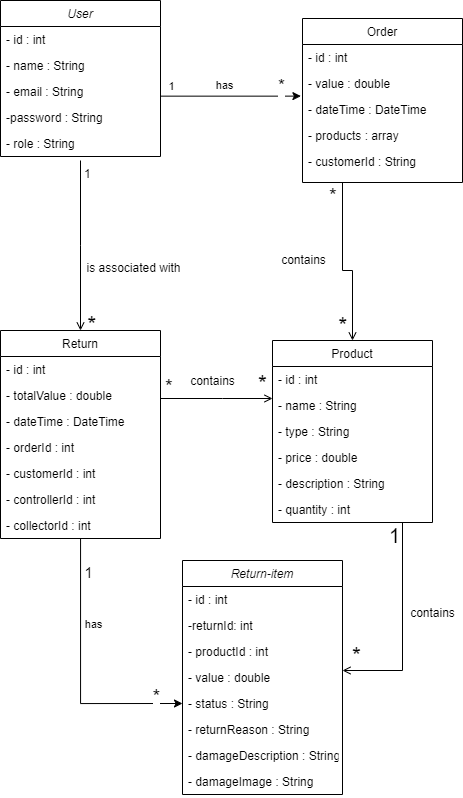
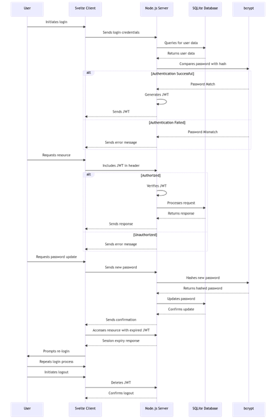

# System Design
# Contents
- [Introduction](#a-nametoc786818551aintroduction)

- [General overview and approach](#a-nametoc462949584ageneral-overview-and-approach)

- [System architecture](#a-nametoc1522741647asystem-architecture)

  * [Frameworks](#a-nametoc1790899903aframeworks)

  * [Database engine](#a-nametoc99145738adatabase-engine)

  * [Log in process](#a-nametoc1018633953alog-in-process)

  * [Routing](#a-nametoc1458709460arouting)

- [Software architecture](#a-nametoc1485664835asoftware-architecture)

  * [Overview](#a-nametoc1926246699aoverview)

  * [Class Diagram](#a-nametoc2100335296aclass-diagram)

  * [API Specification](#a-nametoc909804887aapi-specification)

  * [External Services](#a-nametoc129925777aexternal-services)

    + [QR Code Generation API Integration](#a-nametoc1325172407aqr-code-generation-api-integration)

- [Database design](#database-design)

- [Information Architecture](#a-nametoc1424632184ainformation-architecture)

- [Security Architecture](#a-nametoc1424632184ainformation-architecture)

- [User Interface Design](#a-nametoc1424632184ainformation-architecture)

- [Changelog](#a-nametoc1332919094achangelog)

# Introduction
Welcome to this system design document, the document provides a solid overview of the product design, software architecture and external services used for our application. The purpose of this document is to guide developers, stakeholders, and other interested parties through the intricate parts of the system, ensuring everyone has a clear understanding of the project. 
# General overview and approach
myShop is an e-commerce platform that offers a comprehensive solution for business, catering to both small and medium-sized enterprises as well as multinational corporations. myShop provides an all-in-one e-commerce solution for various business models, including web shops, dealer shops and ticket systems. The platform is designed to be user-friendly, scalable, multilingual and comes with solid support.

The objective of this system design document is to outline our proposed solution on the creation of an RMA application to be added to the current myShop business. This RMA application will be reactive, providing real-time updates and information to all users. By making sure the RMA application can be tailored to be as useful to every e-commerce, an intuitive and user-friendly interface will be created. 

# System architecture
## Frameworks
Our team opted to work with Svelte and Tailwind CSS for several compelling reasons. Svelte, known for its innovative approach to building web applications, caught our attention due to its unique compiler-based architecture that shifts much of the heavy lifting to compile time. This results in exceptionally efficient and lightweight code, enabling faster load times and better runtime performance compared to other frameworks. Its simplicity in writing components without the overhead of a virtual DOM appealed to our development team, allowing us to focus more on crafting functionalities. Additionally, Tailwind CSS, with its utility-first approach to styling, greatly enhances our productivity by providing a comprehensive set of pre-designed utility classes. This approach empowers us to rapidly prototype and create consistent, responsive, and highly customizable UI components without the need to write extensive custom CSS. The combination of Svelte's efficiency in rendering components and Tailwind's streamlined approach to styling aligns perfectly with our goal to build scalable, performant, and visually appealing web applications while minimizing development complexity.
## Database engine
Our team made the deliberate choice to utilize SQLite for our project due to its versatility, simplicity, and efficiency. SQLite's lightweight and serverless nature appealed to us as it perfectly aligned with our project's requirements for a portable and easily manageable database solution. Its self-contained architecture, requiring no separate server setup, significantly streamlined our development process, allowing us to focus more on building the app's features rather than database administration. Given that we are developing a prototype, we are using dummy data and SQLite is the best fit for our project.
## Log in process
Our team opted to implement token-based authentication for several strategic reasons. Firstly, tokens offer a highly secure method for user authentication and authorization, particularly through technologies like JSON Web Tokens (JWT). Their ability to be encrypted and digitally signed provides robust protection against common security threats, ensuring the integrity of user data during transmission and storage. Moreover, tokens enable a stateless authentication process, eliminating the need for server-side session storage. With tokens, we gain the advantage of implementing single sign-on (SSO) solutions, offering users a seamless experience. Most importantly, token-based authentication was particularly advantageous for our system due to the necessity of managing diverse user roles and their associated access permissions. By leveraging tokens, we efficiently implement role-based access control (RBAC), enabling us to embed role information directly into the tokens themselves. This feature allows us to seamlessly authenticate users while simultaneously authorizing their access to specific resources based on their assigned roles.

## Routing
The App component is the root one and it uses routers to navigate to other components, as it can be seen in the diagram below. The app navigates either to the Log in page or to the page of the user’s role. Using routers facilitates the app’s users to access the next steps of their respective processes. 

# Software architecture
## Overview
We chose to build the backend of our system using Node.js and Express because we needed a strong, scalable, and high-performance server solution. Node.js is known for being responsive and efficient due to its non-blocking, event-driven design. Express, a simple and flexible web framework for Node.js, helps us create solid APIs and handle HTTP requests easily. Its middleware architecture makes it easier for us to manage data flow and implement security measures. By combining Node.js and Express, we're confident that our backend can efficiently handle many users at once, providing a smooth experience.
## Class Diagram

## API Specification
#### *1.GET requests*

<table><tr><th colspan="1" valign="top"><b>GET</b></th><th colspan="4" valign="top"><b>/users</b></th></tr>
<tr><td colspan="5" valign="top">Get all users</td></tr>
<tr><td colspan="5" valign="top"></td></tr>
<tr><td colspan="2" valign="top"><b>Parameters:</b></td><td colspan="1" valign="top"><b>Name</b></td><td colspan="1" valign="top"><b>Type</b></td><td colspan="1" valign="top"><b>Description</b></td></tr>
<tr><td colspan="2" rowspan="3" valign="top"><i>* required</i></td><td colspan="1" valign="top">role</td><td colspan="1" valign="top">query</td><td colspan="1" valign="top">Returns users based on the given role</td></tr>
<tr></tr>
<tr></tr>
<tr><td colspan="2" valign="top"><b>Responses:</b></td><td colspan="1" valign="top"><b>Code</b></td><td colspan="2" valign="top"><b>Description / example if successful</b></td></tr>
<tr><td colspan="2" valign="top"></td><td colspan="1" valign="top">200</td><td colspan="2" valign="top">Got the list of users which can be empty</td></tr>
</table>

<table><tr><th colspan="1" valign="top"><b>GET</b></th><th colspan="4" valign="top"><b>/users/{id}</b></th></tr>
<tr><td colspan="5" valign="top">Gets the user with the specified id</td></tr>
<tr><td colspan="5" valign="top"></td></tr>
<tr><td colspan="2" valign="top"><b>Parameters:</b></td><td colspan="1" valign="top"><b>Name</b></td><td colspan="1" valign="top"><b>Type</b></td><td colspan="1" valign="top"><b>Description</b></td></tr>
<tr><td colspan="2" rowspan="2" valign="top"><i>* required</i></td><td colspan="1" valign="top">id*</td><td colspan="1" valign="top">path</td><td colspan="1" valign="top">Id of user to find</td></tr>
<tr></tr>
<tr><td colspan="2" valign="top"><b>Responses:</b></td><td colspan="1" valign="top"><b>Code</b></td><td colspan="2" valign="top"><b>Description / example if successful</b></td></tr>
<tr><td colspan="2" valign="top"></td><td colspan="1" valign="top">200</td><td colspan="2" valign="top">Got the data for the user with the specified id</td></tr>
<tr><td colspan="2" valign="top"></td><td colspan="1" valign="top">404</td><td colspan="2" valign="top">A user with that id is not found</td></tr>
</table>

<table><tr><th colspan="1" valign="top"><b>GET</b></th><th colspan="4" valign="top"><b>/returns</b></th></tr>
<tr><td colspan="5" valign="top">Get all returns</td></tr>
<tr><td colspan="5" valign="top"></td></tr>
<tr><td colspan="2" valign="top"><b>Parameters:</b></td><td colspan="1" valign="top"><b>Name</b></td><td colspan="1" valign="top"><b>Type</b></td><td colspan="1" valign="top"><b>Description</b></td></tr>
<tr><td colspan="2" rowspan="3" valign="top"><i>* required</i></td></tr>
<tr></tr>
<tr></tr>
<tr><td colspan="2" valign="top"><b>Responses:</b></td><td colspan="1" valign="top"><b>Code</b></td><td colspan="2" valign="top"><b>Description / example if successful</b></td></tr>
<tr><td colspan="2" valign="top"></td><td colspan="1" valign="top">200</td><td colspan="2" valign="top">Got the list of returns which can be empty</td></tr>
</table>

<table><tr><th colspan="1" valign="top"><b>GET</b></th><th colspan="4" valign="top"><b>/returns/{id}</b></th></tr>
<tr><td colspan="5" valign="top">Gets the return with the specified id</td></tr>
<tr><td colspan="5" valign="top"></td></tr>
<tr><td colspan="2" valign="top"><b>Parameters:</b></td><td colspan="1" valign="top"><b>Name</b></td><td colspan="1" valign="top"><b>Type</b></td><td colspan="1" valign="top"><b>Description</b></td></tr>
<tr><td colspan="2" rowspan="2" valign="top"><i>* required</i></td><td colspan="1" valign="top">id*</td><td colspan="1" valign="top">path</td><td colspan="1" valign="top">Id of return to find</td></tr>
<tr></tr>
<tr><td colspan="2" valign="top"><b>Responses:</b></td><td colspan="1" valign="top"><b>Code</b></td><td colspan="2" valign="top"><b>Description / example if successful</b></td></tr>
<tr><td colspan="2" valign="top"></td><td colspan="1" valign="top">200</td><td colspan="2" valign="top">Got the data for the return</td></tr>
<tr><td colspan="2" valign="top"></td><td colspan="1" valign="top">404</td><td colspan="2" valign="top">A return with that id is not found</td></tr>
</table>

<table><tr><th colspan="1" valign="top"><b>GET</b></th><th colspan="4" valign="top"><b>/returns/{userId}</b></th></tr>
<tr><td colspan="5" valign="top">Gets the return associated with the specified user id</td></tr>
<tr><td colspan="5" valign="top"></td></tr>
<tr><td colspan="2" valign="top"><b>Parameters:</b></td><td colspan="1" valign="top"><b>Name</b></td><td colspan="1" valign="top"><b>Type</b></td><td colspan="1" valign="top"><b>Description</b></td></tr>
<tr><td colspan="2" rowspan="2" valign="top"><i>* required</i></td><td colspan="1" valign="top">id*</td><td colspan="1" valign="top">path</td><td colspan="1" valign="top">Id of user to find</td></tr>
<tr></tr>
<tr><td colspan="2" valign="top"><b>Responses:</b></td><td colspan="1" valign="top"><b>Code</b></td><td colspan="2" valign="top"><b>Description / example if successful</b></td></tr>
<tr><td colspan="2" valign="top"></td><td colspan="1" valign="top">200</td><td colspan="2" valign="top">Got the data for the return</td></tr>
<tr><td colspan="2" valign="top"></td><td colspan="1" valign="top">404</td><td colspan="2" valign="top">A return associated with that userId is not found</td></tr>
</table>

<table><tr><th colspan="1" valign="top"><b>GET</b></th><th colspan="4" valign="top"><b>/returns/{id}/return-items</b></th></tr>
<tr><td colspan="5" valign="top">Gets the return items for the return with the specified id</td></tr>
<tr><td colspan="5" valign="top"></td></tr>
<tr><td colspan="2" valign="top"><b>Parameters:</b></td><td colspan="1" valign="top"><b>Name</b></td><td colspan="1" valign="top"><b>Type</b></td><td colspan="1" valign="top"><b>Description</b></td></tr>
<tr><td colspan="2" rowspan="2" valign="top"><i>* required</i></td><td colspan="1" valign="top">id*</td><td colspan="1" valign="top">path</td><td colspan="1" valign="top">Id of return to find</td></tr>
<tr></tr>
<tr><td colspan="2" valign="top"><b>Responses:</b></td><td colspan="1" valign="top"><b>Code</b></td><td colspan="2" valign="top"><b>Description / example if successful</b></td></tr>
<tr><td colspan="2" valign="top"></td><td colspan="1" valign="top">200</td><td colspan="2" valign="top">Got the data for the return items</td></tr>
<tr><td colspan="2" valign="top"></td><td colspan="1" valign="top">404</td><td colspan="2" valign="top">A return with that id is not found</td></tr>
</table>

<table><tr><th colspan="1" valign="top"><b>GET</b></th><th colspan="4" valign="top"><b>/returns/{id}/return-items/{id}</b></th></tr>
<tr><td colspan="5" valign="top">Gets the return-item with that id associated to the return with that id</td></tr>
<tr><td colspan="5" valign="top"></td></tr>
<tr><td colspan="2" valign="top"><b>Parameters:</b></td><td colspan="1" valign="top"><b>Name</b></td><td colspan="1" valign="top"><b>Type</b></td><td colspan="1" valign="top"><b>Description</b></td></tr>
<tr><td colspan="2" rowspan="3" valign="top"><i>* required</i></td><td colspan="1" valign="top">id*</td><td colspan="1" valign="top">path</td><td colspan="1" valign="top">Id of return to find</td></tr>
<tr><td colspan="1" valign="top">Id*</td><td colspan="1" valign="top">path</td><td colspan="1" valign="top">Id of return-item to find</td></tr>
<tr></tr>
<tr><td colspan="2" valign="top"><b>Responses:</b></td><td colspan="1" valign="top"><b>Code</b></td><td colspan="2" valign="top"><b>Description / example if successful</b></td></tr>
<tr><td colspan="2" valign="top"></td><td colspan="1" valign="top">200</td><td colspan="2" valign="top">Got the data for the return-item</td></tr>
<tr><td colspan="2" valign="top"></td><td colspan="1" valign="top">404</td><td colspan="2" valign="top">A return-Item associated with that Id is not found</td></tr>
<tr><td colspan="2" valign="top"></td><td colspan="1" valign="top">404</td><td colspan="2" valign="top">A return with that id is not found</td></tr>
</table>

<table><tr><th colspan="1" valign="top"><b>GET</b></th><th colspan="4" valign="top"><b>/products</b></th></tr>
<tr><td colspan="5" valign="top">Get all products</td></tr>
<tr><td colspan="5" valign="top"></td></tr>
<tr><td colspan="2" valign="top"><b>Parameters:</b></td><td colspan="1" valign="top"><b>Name</b></td><td colspan="1" valign="top"><b>Type</b></td><td colspan="1" valign="top"><b>Description</b></td></tr>
<tr><td colspan="2" rowspan="3" valign="top"><i>* required</i></td><td colspan="1" valign="top">type</td><td colspan="1" valign="top">query</td><td colspan="1" valign="top">Returns products based on the given type</td></tr>
<tr></tr>
<tr></tr>
<tr><td colspan="2" valign="top"><b>Responses:</b></td><td colspan="1" valign="top"><b>Code</b></td><td colspan="2" valign="top"><b>Description / example if successful</b></td></tr>
<tr><td colspan="2" valign="top"></td><td colspan="1" valign="top">200</td><td colspan="2" valign="top">Got the list of products which can be empty</td></tr>
</table>

<table><tr><th colspan="1" valign="top"><b>GET</b></th><th colspan="4" valign="top"><b>/products/{id}</b></th></tr>
<tr><td colspan="5" valign="top">Gets the product with the specified id</td></tr>
<tr><td colspan="5" valign="top"></td></tr>
<tr><td colspan="2" valign="top"><b>Parameters:</b></td><td colspan="1" valign="top"><b>Name</b></td><td colspan="1" valign="top"><b>Type</b></td><td colspan="1" valign="top"><b>Description</b></td></tr>
<tr><td colspan="2" rowspan="2" valign="top"><i>* required</i></td><td colspan="1" valign="top">id*</td><td colspan="1" valign="top">path</td><td colspan="1" valign="top">Id of product to find</td></tr>
<tr></tr>
<tr><td colspan="2" valign="top"><b>Responses:</b></td><td colspan="1" valign="top"><b>Code</b></td><td colspan="2" valign="top"><b>Description / example if successful</b></td></tr>
<tr><td colspan="2" valign="top"></td><td colspan="1" valign="top">200</td><td colspan="2" valign="top">Got the data for the product</td></tr>
<tr><td colspan="2" valign="top"></td><td colspan="1" valign="top">404</td><td colspan="2" valign="top">A product with that id is not found</td></tr>
</table>

<table><tr><th colspan="1" valign="top"><b>GET</b></th><th colspan="4" valign="top"><b>/returns/{id}/products</b></th></tr>
<tr><td colspan="5" valign="top">Gets all products of the return with the specified id</td></tr>
<tr><td colspan="5" valign="top"></td></tr>
<tr><td colspan="2" valign="top"><b>Parameters:</b></td><td colspan="1" valign="top"><b>Name</b></td><td colspan="1" valign="top"><b>Type</b></td><td colspan="1" valign="top"><b>Description</b></td></tr>
<tr><td colspan="2" rowspan="2" valign="top"><i>* required</i></td><td colspan="1" valign="top">id*</td><td colspan="1" valign="top">path</td><td colspan="1" valign="top">Id of return to find</td></tr>
<tr></tr>
<tr><td colspan="2" valign="top"><b>Responses:</b></td><td colspan="1" valign="top"><b>Code</b></td><td colspan="2" valign="top"><b>Description / example if successful</b></td></tr>
<tr><td colspan="2" valign="top"></td><td colspan="1" valign="top">200</td><td colspan="2" valign="top">Got the list of products which cannot be empty</td></tr>
<tr><td colspan="2" valign="top"></td><td colspan="1" valign="top">404</td><td colspan="2" valign="top">A return with that id is not found</td></tr>
</table>

<table><tr><th colspan="1" valign="top"><b>GET</b></th><th colspan="4" valign="top"><b>/orders/{id}</b></th></tr>
<tr><td colspan="5" valign="top">Gets the order with the specified id</td></tr>
<tr><td colspan="5" valign="top"></td></tr>
<tr><td colspan="2" valign="top"><b>Parameters:</b></td><td colspan="1" valign="top"><b>Name</b></td><td colspan="1" valign="top"><b>Type</b></td><td colspan="1" valign="top"><b>Description</b></td></tr>
<tr><td colspan="2" rowspan="2" valign="top"><i>* required</i></td><td colspan="1" valign="top">id*</td><td colspan="1" valign="top">path</td><td colspan="1" valign="top">Id of order to find</td></tr>
<tr></tr>
<tr><td colspan="2" valign="top"><b>Responses:</b></td><td colspan="1" valign="top"><b>Code</b></td><td colspan="2" valign="top"><b>Description / example if successful</b></td></tr>
<tr><td colspan="2" valign="top"></td><td colspan="1" valign="top">200</td><td colspan="2" valign="top">Got the data for the order</td></tr>
<tr><td colspan="2" valign="top"></td><td colspan="1" valign="top">404</td><td colspan="2" valign="top">An order with that id is not found</td></tr>
</table>

<table><tr><th colspan="1" valign="top"><b>GET</b></th><th colspan="4" valign="top"><b>/orders/{userId} (customer)</b></th></tr>
<tr><td colspan="5" valign="top">Gets all orders of the customer with the specified id</td></tr>
<tr><td colspan="5" valign="top"></td></tr>
<tr><td colspan="2" valign="top"><b>Parameters:</b></td><td colspan="1" valign="top"><b>Name</b></td><td colspan="1" valign="top"><b>Type</b></td><td colspan="1" valign="top"><b>Description</b></td></tr>
<tr><td colspan="2" rowspan="2" valign="top"><i>* required</i></td><td colspan="1" valign="top">id*</td><td colspan="1" valign="top">path</td><td colspan="1" valign="top">Id of customer(user) to find</td></tr>
<tr></tr>
<tr><td colspan="2" valign="top"><b>Responses:</b></td><td colspan="1" valign="top"><b>Code</b></td><td colspan="2" valign="top"><b>Description / example if successful</b></td></tr>
<tr><td colspan="2" valign="top"></td><td colspan="1" valign="top">200</td><td colspan="2" valign="top">Got the list of orders which cannot be empty</td></tr>
<tr><td colspan="2" valign="top"></td><td colspan="1" valign="top">404</td><td colspan="2" valign="top">A customer with that id is not found</td></tr>
</table>

####

#### *2. POST requests*

<table><tr><th colspan="1" valign="top"><b>POST</b></th><th colspan="4" valign="top"><b>/users</b></th></tr>
<tr><td colspan="5" valign="top">Adds a user</td></tr>
<tr><td colspan="5" valign="top"></td></tr>
<tr><td colspan="2" valign="top"><b>Parameters:</b></td><td colspan="1" valign="top"><b>Name</b></td><td colspan="1" valign="top"><b>Type</b></td><td colspan="1" valign="top"><b>Description</b></td></tr>
<tr><td colspan="2" rowspan="2" valign="top"><i>* required</i></td><td colspan="1" valign="top">user*</td><td colspan="1" valign="top">body</td><td colspan="1" valign="top">The user being added. JSON body gets filled</td></tr>
<tr></tr>
<tr><td colspan="2" valign="top"><b>Responses:</b></td><td colspan="1" valign="top"><b>Code</b></td><td colspan="2" valign="top"><b>Description / example if successful</b></td></tr>
<tr><td colspan="2" rowspan="2" valign="top"></td><td colspan="1" valign="top">201</td><td colspan="2" valign="top">User created successfully and JSON body gets filled</td></tr>
<tr><td colspan="1" valign="top">400</td><td colspan="2" valign="top">User could not be created, because fields are empty or invalid</td></tr>
</table>

<table><tr><th colspan="1" valign="top"><b>POST</b></th><th colspan="4" valign="top"><b>/tokens</b></th></tr>
<tr><td colspan="5" valign="top">Adds a token</td></tr>
<tr><td colspan="5" valign="top"></td></tr>
<tr><td colspan="2" valign="top"><b>Parameters:</b></td><td colspan="1" valign="top"><b>Name</b></td><td colspan="1" valign="top"><b>Type</b></td><td colspan="1" valign="top"><b>Description</b></td></tr>
<tr><td colspan="2" rowspan="2" valign="top"><i>* required</i></td><td colspan="1" valign="top">token*</td><td colspan="1" valign="top">body</td><td colspan="1" valign="top">The token being created.</td></tr>
<tr></tr>
<tr><td colspan="2" valign="top"><b>Responses:</b></td><td colspan="1" valign="top"><b>Code</b></td><td colspan="2" valign="top"><b>Description / example if successful</b></td></tr>
<tr><td colspan="2" rowspan="2" valign="top"></td><td colspan="1" valign="top">201</td><td colspan="2" valign="top">Returns a valid jwt token </td></tr>
<tr><td colspan="1" valign="top">404</td><td colspan="2" valign="top">User not found</td></tr>
<tr><td colspan="2"></td><td colspan="1" valign="top">400</td><td colspan="2" valign="top">Invalid JSON body</td></tr>
</table>

<table><tr><th colspan="1" valign="top"><b>POST</b></th><th colspan="4" valign="top"><b>/products</b></th></tr>
<tr><td colspan="5" valign="top">Adds a product</td></tr>
<tr><td colspan="5" valign="top"></td></tr>
<tr><td colspan="2" valign="top"><b>Parameters:</b></td><td colspan="1" valign="top"><b>Name</b></td><td colspan="1" valign="top"><b>Type</b></td><td colspan="1" valign="top"><b>Description</b></td></tr>
<tr><td colspan="2" rowspan="2" valign="top"><i>* required</i></td><td colspan="1" valign="top">product*</td><td colspan="1" valign="top">body</td><td colspan="1" valign="top">The product that is being added.  JSON body gets filled</td></tr>
<tr></tr>
<tr><td colspan="2" valign="top"><b>Responses:</b></td><td colspan="1" valign="top"><b>Code</b></td><td colspan="2" valign="top"><b>Description / example if successful</b></td></tr>
<tr><td colspan="2" rowspan="2" valign="top"></td><td colspan="1" valign="top">201</td><td colspan="2" valign="top">Product created successfully and JSON body gets filled</td></tr>
<tr><td colspan="1" valign="top">400</td><td colspan="2" valign="top">Product could not be created, because fields are empty or invalid</td></tr>
</table>

<table><tr><th colspan="1" valign="top"><b>POST</b></th><th colspan="4" valign="top"><b>/returns</b></th></tr>
<tr><td colspan="5" valign="top">Adds a return related to the customer with the specified id</td></tr>
<tr><td colspan="5" valign="top"></td></tr>
<tr><td colspan="2" valign="top"><b>Parameters:</b></td><td colspan="1" valign="top"><b>Name</b></td><td colspan="1" valign="top"><b>Type</b></td><td colspan="1" valign="top"><b>Description</b></td></tr>
<tr><td colspan="2" rowspan="3" valign="top"><i>* required</i></td><td colspan="1" valign="top">return*</td><td colspan="1" valign="top">body</td><td colspan="1" valign="top">The return that is being added. JSON body gets gilled.</td></tr>
<tr><td colspan="1" valign="top">Id*</td><td colspan="1" valign="top">Path</td><td colspan="1" valign="top">Id of customer to find</td></tr>
<tr></tr>
<tr><td colspan="2" valign="top"><b>Responses:</b></td><td colspan="1" valign="top"><b>Code</b></td><td colspan="2" valign="top"><b>Description / example if successful</b></td></tr>
<tr><td colspan="2" rowspan="2" valign="top"></td><td colspan="1" valign="top">201</td><td colspan="2" valign="top">Return created successfully and JSON body gets filled</td></tr>
<tr><td colspan="1" valign="top">400</td><td colspan="2" valign="top">Return could not be created, because fields are empty or invalid</td></tr>
<tr><td colspan="2"></td><td colspan="1" valign="top">404</td><td colspan="2" valign="top">Return could not be creates, as customer with the specified id was not found</td></tr>
</table>

####

#### *3. PATCH requests*

<table><tr><th colspan="1" valign="top"><b>PATCH</b></th><th colspan="4" valign="top"><b>users/{id}</b></th></tr>
<tr><td colspan="5" valign="top">Modifies a user, based on the given id</td></tr>
<tr><td colspan="5" valign="top"></td></tr>
<tr><td colspan="2" valign="top"><b>Parameters:</b></td><td colspan="1" valign="top"><b>Name</b></td><td colspan="1" valign="top"><b>Type</b></td><td colspan="1" valign="top"><b>Description</b></td></tr>
<tr><td colspan="2" rowspan="3" valign="top"><i>* required</i></td><td colspan="1" valign="top">id *</td><td colspan="1" valign="top">path</td><td colspan="1" valign="top">The id of the user to be modified</td></tr>
<tr><td colspan="1" valign="top">user *</td><td colspan="1" valign="top">body</td><td colspan="1" valign="top">The user body to modify</td></tr>
<tr></tr>
<tr><td colspan="2" valign="top"><b>Responses:</b></td><td colspan="1" valign="top"><b>Code</b></td><td colspan="2" valign="top"><b>Description / example if successful</b></td></tr>
<tr><td colspan="2" rowspan="2" valign="top"></td><td colspan="1" valign="top">200</td><td colspan="2" valign="top">Body contains the modified user.</td></tr>
<tr><td colspan="1" valign="top">400</td><td colspan="2" valign="top">Body was not modified, because a field is invalid or empty when trying to modify or body id does not match the path id</td></tr>
</table>

<table><tr><th colspan="1" valign="top"><b>PATCH</b></th><th colspan="4" valign="top"><b>returns/{id}</b></th></tr>
<tr><td colspan="5" valign="top">Modifies a return, based on the given id</td></tr>
<tr><td colspan="5" valign="top"></td></tr>
<tr><td colspan="2" valign="top"><b>Parameters:</b></td><td colspan="1" valign="top"><b>Name</b></td><td colspan="1" valign="top"><b>Type</b></td><td colspan="1" valign="top"><b>Description</b></td></tr>
<tr><td colspan="2" rowspan="3" valign="top"><i>* required</i></td><td colspan="1" valign="top">id *</td><td colspan="1" valign="top">path</td><td colspan="1" valign="top">The id of the return to be modified</td></tr>
<tr><td colspan="1" valign="top">return *</td><td colspan="1" valign="top">body</td><td colspan="1" valign="top">The return body to modify</td></tr>
<tr></tr>
<tr><td colspan="2" valign="top"><b>Responses:</b></td><td colspan="1" valign="top"><b>Code</b></td><td colspan="2" valign="top"><b>Description / example if successful</b></td></tr>
<tr><td colspan="2" rowspan="2" valign="top"></td><td colspan="1" valign="top">200</td><td colspan="2" valign="top">Body contains the modified return.</td></tr>
<tr><td colspan="1" valign="top">400</td><td colspan="2" valign="top">Body was not modified, because a field is invalid or empty when trying to modify or body id does not match the path id</td></tr>
</table>

<table><tr><th colspan="1" valign="top"><b>PATCH</b></th><th colspan="4" valign="top"><b>products/{id}</b></th></tr>
<tr><td colspan="5" valign="top">Modifies a product, based on the given id</td></tr>
<tr><td colspan="5" valign="top"></td></tr>
<tr><td colspan="2" valign="top"><b>Parameters:</b></td><td colspan="1" valign="top"><b>Name</b></td><td colspan="1" valign="top"><b>Type</b></td><td colspan="1" valign="top"><b>Description</b></td></tr>
<tr><td colspan="2" rowspan="3" valign="top"><i>* required</i></td><td colspan="1" valign="top">id *</td><td colspan="1" valign="top">path</td><td colspan="1" valign="top">The id of the product to be modified</td></tr>
<tr><td colspan="1" valign="top">product *</td><td colspan="1" valign="top">body</td><td colspan="1" valign="top">The product body to modify</td></tr>
<tr></tr>
<tr><td colspan="2" valign="top"><b>Responses:</b></td><td colspan="1" valign="top"><b>Code</b></td><td colspan="2" valign="top"><b>Description / example if successful</b></td></tr>
<tr><td colspan="2" rowspan="2" valign="top"></td><td colspan="1" valign="top">200</td><td colspan="2" valign="top">Body contains the modified product.</td></tr>
<tr><td colspan="1" valign="top">400</td><td colspan="2" valign="top">Body was not modified, because a field is invalid or empty when trying to modify or body id does not match the path id</td></tr>
</table>

#### *4. DELETE requests*

<table><tr><th colspan="1" valign="top"><b>DELETE</b></th><th colspan="4" valign="top"><b>/users/{id}</b></th></tr>
<tr><td colspan="5" valign="top">Deletes the user with the specified id</td></tr>
<tr><td colspan="5" valign="top"></td></tr>
<tr><td colspan="2" valign="top"><b>Parameters:</b></td><td colspan="1" valign="top"><b>Name</b></td><td colspan="1" valign="top"><b>Type</b></td><td colspan="1" valign="top"><b>Description</b></td></tr>
<tr><td colspan="2" rowspan="2" valign="top"><i>* required</i></td><td colspan="1" valign="top">id*</td><td colspan="1" valign="top">path</td><td colspan="1" valign="top">Id of the user to delete</td></tr>
<tr></tr>
<tr><td colspan="2" valign="top"><b>Responses:</b></td><td colspan="1" valign="top"><b>Code</b></td><td colspan="2" valign="top"><b>Description / example if successful</b></td></tr>
<tr><td colspan="2" rowspan="2" valign="top"></td><td colspan="1" valign="top">200</td><td colspan="2" valign="top">User deleted </td></tr>
<tr><td colspan="1" valign="top">404</td><td colspan="2" valign="top">A user with that Id is not found</td></tr>
</table>

<table><tr><th colspan="1" valign="top"><b>DELETE</b></th><th colspan="4" valign="top"><b>/returns/{id}</b></th></tr>
<tr><td colspan="5" valign="top">Deletes data for a return with the specified id</td></tr>
<tr><td colspan="5" valign="top"></td></tr>
<tr><td colspan="2" valign="top"><b>Parameters:</b></td><td colspan="1" valign="top"><b>Name</b></td><td colspan="1" valign="top"><b>Type</b></td><td colspan="1" valign="top"><b>Description</b></td></tr>
<tr><td colspan="2" rowspan="3" valign="top"><i>* required</i></td><td colspan="1" valign="top">id*</td><td colspan="1" valign="top">path</td><td colspan="1" valign="top">Id of the return to delete</td></tr>
<tr></tr>
<tr></tr>
<tr><td colspan="2" valign="top"><b>Responses:</b></td><td colspan="1" valign="top"><b>Code</b></td><td colspan="2" valign="top"><b>Description / example if successful</b></td></tr>
<tr><td colspan="2" rowspan="2" valign="top"></td><td colspan="1" valign="top">200</td><td colspan="2" valign="top">Return deleted</td></tr>
<tr><td colspan="1" valign="top">404</td><td colspan="2" valign="top">A return with that Id is not found</td></tr>
</table>

<table><tr><th colspan="1" valign="top"><b>DELETE</b></th><th colspan="4" valign="top"><b>/products/{id}</b></th></tr>
<tr><td colspan="5" valign="top">Deletes data for a product with the specified id</td></tr>
<tr><td colspan="5" valign="top"></td></tr>
<tr><td colspan="2" valign="top"><b>Parameters:</b></td><td colspan="1" valign="top"><b>Name</b></td><td colspan="1" valign="top"><b>Type</b></td><td colspan="1" valign="top"><b>Description</b></td></tr>
<tr><td colspan="2" rowspan="3" valign="top"><i>* required</i></td><td colspan="1" valign="top">id*</td><td colspan="1" valign="top">path</td><td colspan="1" valign="top">Id of the product to delete</td></tr>
<tr></tr>
<tr></tr>
<tr><td colspan="2" valign="top"><b>Responses:</b></td><td colspan="1" valign="top"><b>Code</b></td><td colspan="2" valign="top"><b>Description / example if successful</b></td></tr>
<tr><td colspan="2" rowspan="2" valign="top"></td><td colspan="1" valign="top">200</td><td colspan="2" valign="top">Product deleted</td></tr>
<tr><td colspan="1" valign="top">404</td><td colspan="2" valign="top">A product with that Id is not found</td></tr>
</table>

##

## External Services
### QR Code Generation API Integration
**Overview**

In our application, the integration of QR codes serves to facilitate the collector to identify which order and products are being returned. To facilitate this functionality, it will be implemented the QR code generation service provided by goQR.me.

**Service Description**

goQR.me offers a RESTful API that allows applications to generate QR codes programmatically. These QR codes will encode the id of the order being returned and the products. The service is known for its reliability, ease of use, and the ability to produce QR codes that are compatible with standard scanning devices and applications.

**Integration Points**

The QR code API is utilized in the customer returns page where customers can generate a QR code for each return request, which will be printed and attached to the return package for identification.

**Usage Flow**

- **API Request**: When a QR code is needed, the system sends a request to the goQR.me API endpoint, specifying the data to be encoded and any customization options for the QR code image.
- **Response Handling**: The API responds with a generated QR code image, which the system then processes by sending it to the customer to print it.
- **Error Handling**: In the event of a failure (e.g., API downtime, invalid input), our system has fallback mechanisms to inform the user and retry the request if necessary.

**Security and Compliance**

All data transmitted to and from the goQR.me API is encrypted using HTTPS to protect sensitive information. Additionally, we ensure that the QR codes generated do not include any personal or confidential data that could be compromised.

#

# Database design

This is the database design for the RMA system we are building.

- RMA – contains all the data of an RMA.
- RMAItem – contains items that are related to an RMA. This separate table allows us to link multiple products to one RMA, as the requirements suggest.
- User – contains user accounts.
- Role – contains roles and their IDs. This is made so in case any other user type will need to interact with the system, their role can be easily incorporated into the system.
- Order – table we are using to simulate user purchases.
- OrderDetails – contains the products that were bought in a single order. 
- Product – table we use to simulate warehouses stock. Contains products and their properties.

#

# Information Architecture
This chapter presents the information architecture for the MyShop RMA application, as derived from the database diagram provided. The architecture outlines the data entities, their relationships, and the flow of information between them. This structure is designed to support the application's functionality while ensuring data integrity and security.

The database consists of several primary entities: User, RMA, RMAItem, Product, Role, Order, and OrderDetails. Each entity is designed to store specific types of data, which are outlined as follows:

**User**

Data Stored: Contains user credentials and personal details, including UserID, Username, Password, Role, and Email. This entity is central to the user management and authentication processes.

PII Considerations: The User entity holds Personally Identifiable Information (PII) that necessitates stringent security measures to protect user privacy.

**RMA**

Data Stored: Tracks the Return Merchandise Authorization (RMA) details, such as RMAID, orderID, customerID, creation date, status, return reason, and the IDs of the collector and controller handling the RMA.

Data Flow: RMAs are created by Users (customers) and are processed by Users with Collector and Controller roles.

**RMAItem**

Data Stored: Pertains to individual items within an RMA, storing data like RMAItemID, RMAID, ProductID, status, damage description, and images.

Link to Products: RMAItems are linked to the Product entity, detailing which items are being returned.

**Product**

Data Stored: Includes information about the products, such as ProductID, Name, Description, Price, StockQuantity, and a flag indicating if it's a food item.

Relation to OrderDetails: Products are associated with OrderDetails to reflect items purchased in orders.

**Role**

Data Stored: Describes the roles within the system, with RoleID and RoleName.

Usage: Determines the access level and permissions within the RMA application.

**Order**

Data Stored: Captures order information, including orderID, customerID, order date, total amount, and status.

Data Flow: Orders are placed by Users and contain multiple OrderDetails.

**OrderDetails**

Data Stored: Holds the specifics of items within an order, such as OrderDetailID, orderID, ProductID, Quantity, and Subtotal.

Connection to Orders: Each OrderDetail is part of an Order, providing a breakdown of the items and quantities ordered.

# Security Architecture

**Overview**

The security architecture of the myShop RMA application is designed to ensure the integrity, confidentiality, and availability of data. The architecture is built around robust authentication, authorization, and data protection mechanisms, primarily leveraging JSON Web Tokens (JWT) and bcrypt.

Authentication and Authorization

- **JWT for Secure Sessions:** JSON Web Tokens (JWT) are employed for managing sessions and ensuring secure authentication. This token-based system allows for stateless authentication, meaning the server does not need to maintain a session state for each user, enhancing scalability and performance.
- **Role-Based Access Control (RBAC):** Each user role (Administrator, Customer, Collector, Controller) is assigned specific permissions and access levels. JWTs carry this role information, allowing the server to grant or restrict access to resources based on the user's role.
- **Token Issuance and Expiry:** Tokens are issued upon successful login and have a predetermined expiry time to reduce the risk of token hijacking. Users are automatically logged out when the token expires, necessitating re-authentication.

Data Protection

- **bcrypt for Password Security:** bcrypt, a secure hashing algorithm, is utilized for password protection. User passwords are hashed before being stored in the database, ensuring that actual passwords are not stored in a readable format.
- **Salting:** bcrypt automatically incorporates a salt (a random value) to each password before hashing, providing an additional layer of security against rainbow table attacks.

# User Interface Design

This chapter details the user interface (UI) architecture of the myShop RMA application. The UI is engineered to support distinct user roles—administrators, collectors, controllers, and customers—while maintaining a uniform design schema that enhances usability and facilitates role-based task management. The four UI designs presented here serve as exemplars for the entire application, illustrating the overarching design principles and interaction models that will be applied consistently throughout. These designs provide a reference for the UI's visual language and functional elements in both mobile and desktop contexts.

**Design System and Color Scheme**

The UI utilizes a dark theme design system, employing a color scheme optimized for reduced luminance emission, which minimizes eye strain. A base color of dark grey (#121212) is used throughout the interface, which provides an effective backdrop for the accent color, a bright yellow (#FFC107), used to highlight actionable items, facilitating ease of use and navigability. The designs for the controller role on mobile and desktop are indicative of the application-wide color scheme.

` `

**Typography**

The application standardizes on the Roboto font family due to its geometric precision and friendly appearance, which ensures excellent on-screen legibility. The application's text hierarchy is clearly defined by varying the font size and weight, thus ensuring that users can easily distinguish between different types of information.** 

**Consistency and Component Framework**

A hallmark of the UI is its consistent look and feel, which will be achieved using Svelte as the component framework in the development phase. Svelte will enable the creation of modular, reactive components that are both efficient and maintainable. These components will encapsulate common elements such as buttons, input fields, and dropdowns, ensuring consistency and reusability across the application.

**Responsive Design**

The application's design is responsive, ensuring that the UI scales appropriately across various devices. On mobile devices, the UI is optimized for one-handed operation with a single-column view, while the desktop version expands to a multi-column layout to efficiently utilize available screen real estate.** The responsive design will be implemented using media queries and flexible grid layouts that adjust to the viewport's dimensions, ensuring that the UI maintains its integrity and functionality across different devices and orientations.** 

The presented UI designs for the controller role are illustrative of the design language that will be implemented throughout the myShop RMA application. These designs set the stage for the development of a consistent and responsive UI, with Svelte as the chosen framework to construct a dynamic and user-friendly interface for all roles within the application.­

# Changelog

| Date       | Version | Description                             |
|:-----------|:--------|:----------------------------------------|
| 30/11/2023 | V1      | Finished first version of system design |
| 14/12/2023 | V2      | Refactored class diagram and API spec.  |